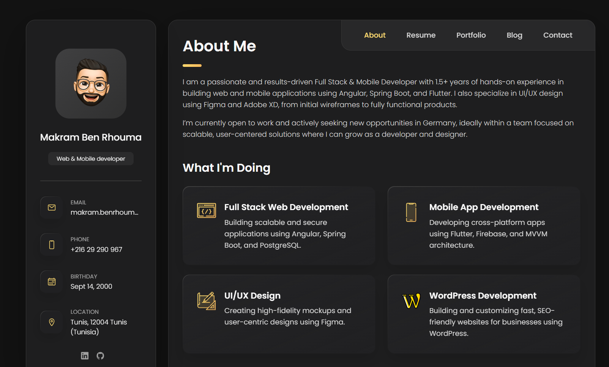

# Makram Ben Rhouma - Personal Portfolio



A modern, fully responsive personal portfolio website showcasing my skills as a Full Stack & Mobile Developer. Built with clean HTML5, CSS3, and vanilla JavaScript, featuring a sleek dark theme and smooth animations.

## 🚀 Live Demo

[View Live Portfolio](https://makram-benrhouma-dev.github.io/portfolio/)

## 📋 Table of Contents

- [About](#about)
- [Features](#features)
- [Technologies Used](#technologies-used)
- [Sections](#sections)
- [Installation](#installation)
- [Usage](#usage)
- [Project Structure](#project-structure)
- [Customization](#customization)
- [Contact](#contact)
- [License](#license)

## 🎯 About

This portfolio represents my journey as a Full Stack & Mobile Developer with 1.5+ years of experience. It showcases my expertise in:

- **Frontend**: Angular, HTML5, CSS3, SCSS, Bootstrap
- **Backend**: Java, Spring Boot, REST APIs
- **Mobile**: Flutter, Dart, Firebase
- **UI/UX**: Figma, Adobe XD, Photoshop
- **CMS**: WordPress Development

Currently seeking opportunities in Germany to grow as a developer in scalable, user-centered solutions.

## ✨ Features

- **Fully Responsive Design** - Works perfectly on all devices
- **Modern Dark Theme** - Elegant and professional appearance
- **Smooth Animations** - CSS transitions and keyframe animations
- **Interactive Navigation** - Single-page application with smooth scrolling
- **Contact Form Integration** - Powered by Formspree for direct messaging
- **Social Media Links** - Direct links to LinkedIn and GitHub
- **Portfolio Filtering** - Dynamic project filtering by category
- **Testimonials Carousel** - Client feedback with modal view
- **Skills Progress Bars** - Visual representation of technical skills
- **Blog Section** - Professional insights and experiences
- **SEO Optimized** - Meta tags and semantic HTML structure

## 🛠️ Technologies Used

- **HTML5** - Semantic markup and structure
- **CSS3** - Modern styling with custom properties and grid/flexbox
- **JavaScript (ES6+)** - Interactive functionality and DOM manipulation
- **Ionicons** - Beautiful icon library
- **Google Fonts** - Poppins font family
- **Formspree** - Contact form backend service

## 📄 Sections

### 1. About Me
- Professional introduction
- Services offered (Full Stack, Mobile, UI/UX, WordPress)
- Client testimonials
- Company logos/clients

### 2. Resume
- Educational background
- Professional experience timeline
- Technical skills with proficiency levels
- Language proficiencies

### 3. Portfolio
- Featured projects with filtering
- Categories: Web Development, Applications, Web Design
- Project previews with hover effects

### 4. Blog
- Professional insights
- Development tips and experiences
- Career journey articles

### 5. Contact
- Interactive contact form
- Location map (Tunis, Tunisia)
- Direct contact information
- Social media links

## 🚀 Installation

### Prerequisites

- [Git](https://git-scm.com/downloads) installed on your system
- A modern web browser
- Code editor (VS Code recommended)

### Clone the Repository

```bash
# Clone the repository
git clone https://github.com/Makram-BenRhouma-Dev/portfolio.git

# Navigate to project directory
cd portfolio

# Open in your preferred code editor
code .
```

### Local Development

Simply open `index.html` in your browser or use a local server:

```bash
# Using Python (if installed)
python -m http.server 8000

# Using Node.js (if http-server is installed)
npx http-server

# Using PHP (if installed)
php -S localhost:8000
```

## 📁 Project Structure

```
portfolio/
│
├── index.html                 # Main HTML file
├── README.md                 # Project documentation
│
├── assets/
│   ├── css/
│   │   └── style.css         # Main stylesheet
│   │
│   ├── js/
│   │   └── script.js         # JavaScript functionality
│   │
│   └── images/
│       ├── my-avatar.png     # Profile picture
│       ├── logo.ico          # Favicon
│       ├── project-*.png     # Portfolio project images
│       ├── blog-*.jpg        # Blog post images
│       ├── avatar-*.png      # Testimonial avatars
│       ├── logo-*-color.png  # Client logos
│       └── icon-*.svg        # Service icons
│
└── website-demo-image/       # Demo screenshots
```

## 🎨 Customization

### Personal Information

1. **Update Profile**: Replace `assets/images/my-avatar.png` with your photo
2. **Contact Details**: Modify contact information in the sidebar section
3. **Social Links**: Update LinkedIn and GitHub URLs
4. **Resume Content**: Edit experience, education, and skills sections

### Styling

The CSS uses custom properties (CSS variables) for easy theming:

```css
:root {
  --orange-yellow-crayola: hsl(45, 100%, 72%);
  --eerie-black-1: hsl(240, 2%, 13%);
  --white-2: hsl(0, 0%, 98%);
  /* Modify these values to change the color scheme */
}
```

### Adding Projects

Add new portfolio items in the portfolio section:

```html
<li class="project-item active" data-filter-item data-category="web development">
  <a href="#">
    <figure class="project-img">
      <div class="project-item-icon-box">
        <ion-icon name="eye-outline"></ion-icon>
      </div>
      
    </figure>
    <h3 class="project-title">Your Project Name</h3>
    <p class="project-category">Web development</p>
  </a>
</li>
```

## 📱 Responsive Design

The portfolio is fully responsive with breakpoints at:
- **Mobile**: < 450px
- **Tablet**: 450px - 768px
- **Desktop**: 768px - 1024px
- **Large Desktop**: > 1024px

## 🔧 Browser Support

- Chrome (latest)
- Firefox (latest)
- Safari (latest)
- Edge (latest)

## 📈 Performance Features

- **Lazy Loading**: Images load only when needed
- **Optimized Assets**: Compressed images and minified code
- **Smooth Scrolling**: Enhanced user experience
- **Fast Loading**: Minimal dependencies

## 🤝 Contributing

Contributions, issues, and feature requests are welcome! Feel free to check the [issues page](https://github.com/Makram-BenRhouma-Dev/portfolio/issues).

## 📞 Contact

**Makram Ben Rhouma**
- Email: [makram.benrhouma@gmail.com](mailto:makram.benrhouma@gmail.com)
- LinkedIn: [Makrem Ben Rhouma](https://www.linkedin.com/in/makrem-ben-rhouma-201840204/)
- GitHub: [@Makram-BenRhouma-Dev](https://github.com/Makram-BenRhouma-Dev)
- Location: Tunis, Tunisia

## 📄 License

This project is licensed under the MIT License - see the [LICENSE](LICENSE) file for details.

## 🙏 Acknowledgments

- Design inspiration from modern portfolio trends
- Icons by [Ionicons](https://ionic.io/ionicons)
- Fonts by [Google Fonts](https://fonts.google.com/)
- Form handling by [Formspree](https://formspree.io/)

---

⭐ **If you found this portfolio helpful, please give it a star!** ⭐

*Currently open to work and seeking opportunities in Germany. Let's connect!*
